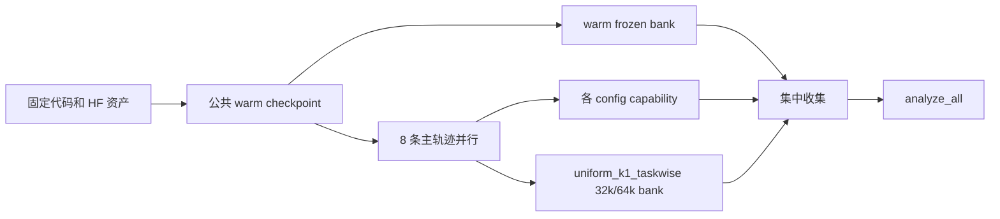

# 多人跨机器并行协作

## 角色

协调者负责：

- 冻结唯一 Git commit/tag 和实验资产版本；
- 维护 `campaign.example.yaml` 的副本或对应 GitHub Issue；
- 保证所有人使用同一公共 warm checkpoint；
- 分配唯一 config，收集分析包；
- 运行 frozen banks 和最终集中分析。

执行者负责：

- 在正式开跑前通过 `preflight`；
- 只运行分配给自己的 config；
- 失败时使用 `resume`，不删除原目录重跑；
- 完成 capability、package，并回填 W&B 链接和包位置。

## 依赖图



公共 warm 已包含在 `zsqzz/mopd-gpas-64k-models`，worker 不再各自运行 warm。只有协议发生正式版本升级时，协调者才重新生成并重新发布 warm。

## 任务认领表

把 `configs/campaign.example.yaml` 复制到 campaign Issue 或协作表。推荐字段：

| Config ID | Owner | Machine | Status | W&B URL | Package URL | Note |
|---|---|---|---|---|---|---|
| `uniform_k1_conventional` | — | — | pending | — | — | — |
| `uniform_k1_taskwise` | — | — | pending | — | — | 解锁 middle/late bank |
| `gpas_k1_taskwise` | — | — | pending | — | — | — |
| `cost_gpas_k1_taskwise` | — | — | pending | — | — | — |
| `uniform_k2_taskwise` | — | — | pending | — | — | — |
| `cost_gpas_k2_taskwise` | — | — | pending | — | — | — |
| `all_k4_taskwise` | — | — | pending | — | — | — |
| `all_k4_conventional` | — | — | pending | — | — | — |

状态只使用 `pending → running → complete → uploaded → verified`；失败但可恢复时记为 `failed/resumable`。

## Worker 标准操作

```bash
git checkout <campaign-commit-or-tag>
source local/mopd.env
bash examples/mopd_gpas/run_stage.sh preflight

CONFIG_ID=<assigned-config>
bash examples/mopd_gpas/run_stage.sh train "${CONFIG_ID}"
bash examples/mopd_gpas/run_stage.sh capability "${CONFIG_ID}"
bash examples/mopd_gpas/run_stage.sh package "${CONFIG_ID}"
```

每台两卡 worker 同时只运行一条主轨迹。不要让两个人使用同一个 config ID，也不要让两个进程写同一个 `MOPD_OUTPUT_ROOT`。

四卡单机可以继续使用：

```bash
bash examples/mopd_gpas/run_stage.sh train4
```

它会在本机建立两个隔离 student/teacher pair，并让每个 pair 顺序处理四条轨迹。跨机器时直接使用单 config 的 `train` 入口，不使用 `train4`。

## 结果交接

执行者交付三样内容：

1. `${CONFIG_ID}-seed42-analysis.tar.gz`；
2. W&B run URL；
3. 一行运行备注：机器名、GPU ID、是否发生 resume、SandboxFusion endpoint 是否正常。

协调者解包时保持目录名不变：

```bash
tar -xzf <package> -C "${MOPD_OUTPUT_ROOT}"
```

收到包后先运行同一个 `package` 验收命令；八条 config 和三项 bank 全部到齐后再运行 `analyze`。

## 不应合并的结果

以下情况单独保留，不进入主表：

- Git commit/tag 与 campaign 不同；
- 修改过 seed、response budget、task slice、超参数或评测数据；
- 使用非正式 GPU，但仍试图合并 GPU-hour/HBM/transfer 指标；
- 没有从公共 warm checkpoint 分叉；
- 主训练或 capability 缺少 complete marker。
